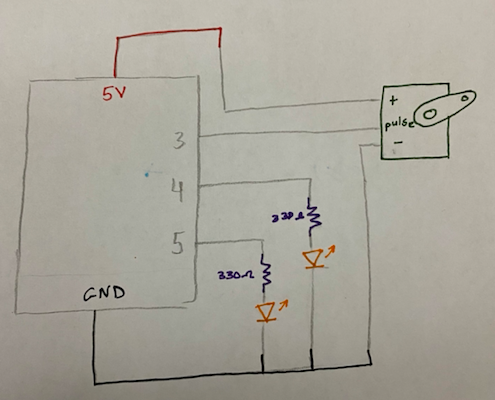

### Description of Game:

- For the final project I decided to re-visit my midterm project game and adjust it to include processing and Arduino elements and functions. A recap on how my midterm game worked is that it was one player game, where the l and r keys are used to move the paddle away from the bouncing ball trying to avoid touching it. If the paddle touches the ball, then the player loses some lives. To use Arduino elements, I'll have a one side communication taking place from Processing to Arduino. I’ll add two LED lights for showing when the game starts and when the player loses. I’ll add a servo motor where it’ll move either left or right depending on the which key was pressed l or r.

### 24 November 2020:

- I worked on writing my thoughts on how the game will be adjusted to include Arduino, in the journal as a part of the game description. A schematic was drawn to imagine how things will go if they continue to be the same.

