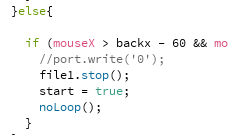
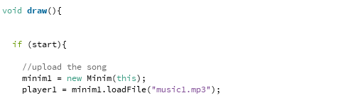

### Description of Project:

For the final project, I want to have a one side communication happening from processing to Arduino. In the processing screen I would have 4 circles and if any of the circles was pressed the screen changes, a song plays, and the LEDs blink as if they are dancing. Instead of having a dancing fountain I have dancing LEDs. 

### 26 November 2020:

- I started looking for inspirations for my final project and Dubai Mall’s fountain was one. I wanted to have something similar where things dance as an output. So, I decided to have music playing and the LEDs blink as if they are dancing according the rhythm of the music.

- A video of the Dubai Mall's fountain:

- This is how is a simple sketch of how I imagine things will be:

### 27 November 2020:

- I worked on the processing code where I applied what I wanted to have to one circle of changing the background once the circle is pressed. 

- This is how it looked:

- I decided to get things done for one circle then apply the same strategy for the rest.

- I tried adding the music in the draw function for it to play when the circle is pressed however because it was in the draw function I played over and over again. To solve this problem, I used stackoverflow and I used this link for help: https://stackoverflow.com/questions/40712592/how-to-use-play-inside-draw-in-processing-3, and it worked. I created an int x variable and the song played once.

- This is the part I added to the code:

### 28 November 2020:

- I worked on adding a back option in processing so whenever you wanted to change the song and go back to the main menu the song stops and the main menu shows. I got the song to stop but the main menu didn’t show up and the problem was that I had a no loop and when I removed it worked.

- This is how the things were:

- This is where the code failed to perform what it meant to do:

- This is how it worked after getting rid of the noLoop():

- Another problem with the song was that after it played once and I went back to the main menu and clicked again to play the song again it didn’t play. 

- This is how it looked:

### Note: the video is too big to be displayed by can be found in folder final project named "vid5.mov".

- I solved this issue by adding the upload option of the game in inside the draw function rather than the setup for it to play multiple times and this solved the issue.

- This how the processing screen looked after:

### Note: the video is too big to be displayed by can be found in folder final project named "vid6.mov".

- This is how the code looked:

- Unfortunately, after running the sketch a couple of times the song stopped playing again and a an error message showed up which is OutOfMemoryError. I thought maybe to keep the code this way and come back to it at the end if I wanted to or keep it this way where it plays once. 

- Another thing with the sound system code was that I switch to using the minim library. This is because the minim library had the option to playback, record, analysis and synthesis of sound which was an easier way to control the LEDs depending on the beat or the information I get from the song. This was also recommended by Professor Shiloh which will make the Arduino part of the code be easier to control.

### 29 November 2020:

- Today I thought why not add a theme to the project and since Christmas is on its way, I wanted the project to have a Christmas theme with Christmas songs. 

- I had another issue with the sound where when I added the other 4 songs to play only one played even when I pressed back and went to the main menu and pressed another circle.

- This was the problem:

### Note: the video is too big to be displayed by can be found in folder final project named "vid7.mov".

- So, I did that. Plus, I used this link https://stackoverflow.com/questions/17556228/how-to-play-only-one-audio-file-at-a-time-in-minim to solve the issue of playing different songs depending on button pressed and going back to the main menu. I used the close() and this was the mistake, I used rewind() and pause() functions and it worked. But it still played the song once.

- This is how it turned after adjusting the code:

### Note: the video is too big to be displayed by can be found in folder final project named "vid8.mov".

### 30 November 2020:

- Today I worked a bit on the aesthetics of the processing window. By adding some writings and colors. I remembered that Katie once used a nice font, so I asked her and used the same font she used from her October 6 assignment.

- This is how the screen looks:

### Note: the video is too big to be displayed by can be found in folder final project named "vid9.mov".

- I also worked a having the Arduino communicate with processing today. I used one of the examples from processing as a starting point which was can be found in Processing > Examples > Contributed Examples > Learning Processing 2nd Edition > Chp 20 Sound > Example 8 Playback Analysis. Although the library used in this example was processing sound, I still implemented it in the processing code I had for my project.

- At first it was kind of weird and a bit difficult and confusing because I had to shift a couple of times between sound libraries. However, I used the same logic in applied in the example for my code. I had a bit of hard time because the functions were different, and I had to figure out how to organize the play and stop functions with having trouble of looping or stopping in the wrong time, but it worked. I only applied the code to only one song and tried it out and it worked. 

- I also worked on getting an Arduino code to see if things worked and they did. But maybe I’ll reduce the number of LEDs I had because the restrictions for blinking LEDs are very small only from 0 to 1.0 and I thought it would be better to have fewer lights to accompany the restrictions. 

- This is how it looks:

### Note: the video is too big to be displayed by can be found in folder final project named "vid10.mov".

