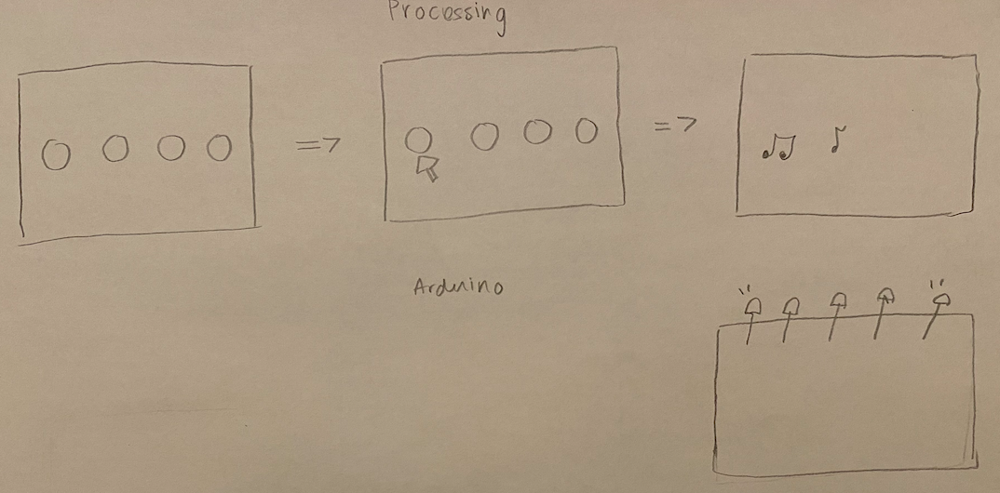
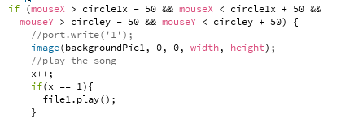

### Description of Project:

For the final project, I want to have a one side communication happening from processing to Arduino. In the processing screen I would have 4 circles and if any of the circles was pressed the screen changes, a song plays, and the LEDs blink as if they are dancing. Instead of having a dancing fountain I have dancing LEDs. 

### 26 November 2020:

- I started looking for inspirations for my final project and Dubai Mall’s fountain was one. I wanted to have something similar where things dance as an output. So, I decided to have music playing and the LEDs blink as if they are dancing according the rhythm of the music.

- A video of the Dubai Mall's fountain:

- This is how is a simple sketch of how I imagine things will be:

### 27 November 2020:

- I worked on the processing code where I applied what I wanted to have to one circle of changing the background once the circle is pressed. 

- This is how it looked:

- I decided to get things done for one circle then apply the same strategy for the rest.

- I tried adding the music in the draw function for it to play when the circle is pressed however because it was in the draw function I played over and over again. To solve this problem, I used stackoverflow and I used this link for help: https://stackoverflow.com/questions/40712592/how-to-use-play-inside-draw-in-processing-3, and it worked. I created an int x variable and the song played once.

- This is the part I added to the code:

