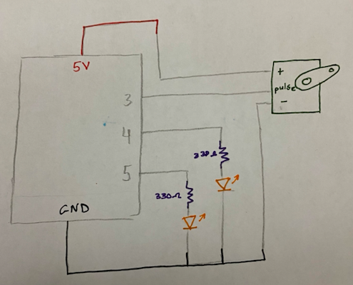

### Description of Game:

- For the final project I decided to re-visit my midterm project game and adjust it to include processing and arduino elements and functions. A recap on how my midterm game worked is that it was one player game, where the l and r keys are used to move the paddle aways from the boucing ball trying to avoid touching it. If the paddle touches the ball, then the player loses some lives. To use Ardunio elements I'll have the player to use two switchess to move the paddle away rather than l and r keys. I may also add LEDs to point to which switch button is being pressed. Finally, maybe I'll have and red LED work when the player loses the game.

### 24 November 2020:

- I worked on writing my thoughts on how the game will be adjusted to include ardiuno, in the journal. A schematic was drawn to imagine how things will go if they continue to be the same.

