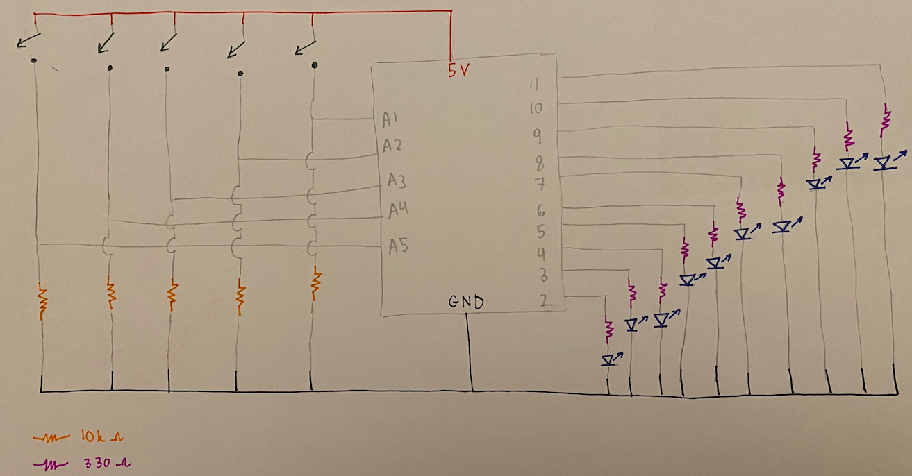
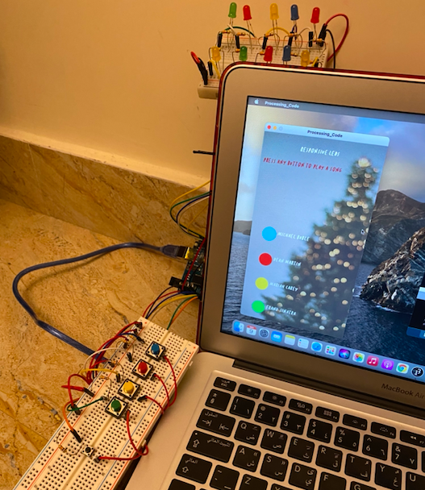
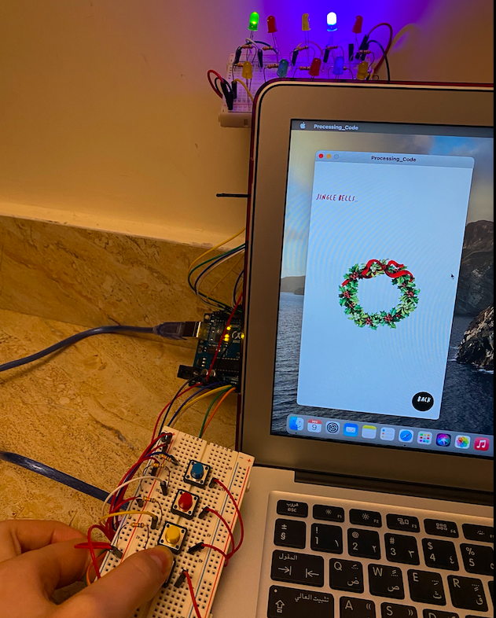

# Final Project: Responsive LEDs

## Final Project Journey

## Project Description:

The project was inspired by the Dubai Mall's Fountain and how it works depending on the music played. The project consists of a communication between both Arduino and Processing. When a button is pressed from the Arduino side, the background changes, a music plays, and the LEDs blink according to the music volume. There are four options to choose from that are linked to four different buttons where each one includes a different song, background, and LEDs blink. A back back button is there too to leave to the main page. The project is Christmas themed with different Christmas backgrounds and songs playing.

## Major Problems:

- The first problem was having the sound in the draw function without the it is playing over and over again. It was resolved by googling my problem and following the tip provided by this [website](https://stackoverflow.com/questions/40712592/how-to-use-play-inside-draw-in-processing-3) and it worked.

- The second problem is using the sound library to analyze the sound and get it to do something. I used the example found in processing (Processing > Examples > Contributed Examples > Learning Processing 2nd Edition > Chp 20 Sound > Example 8 Playback Analysis) which helped being a basis for my work.

- The third problem was getting different sounds to play at different button presses. I used this [link](https://stackoverflow.com/questions/17556228/how-to-play-only-one-audio-file-at-a-time-in-minim) as a guidance to solve this issue.

- The fourth problem was getting communication to happen from Arduino to Processing. To solve this issue, I looked into Omar's [code](https://github.com/soablackwhite/Intro-to-IM/blob/master/Nov24th/multiplayer.pde) used in his November 24th assignment and followed the same methods. I also got some help from the professor by asking on Discord.

- The fifth problem was stopping the sound from playing. I tried different functions where are rewind(), pause(), close() and stop() functions until one of them worked well.

- The sixth problem was understanding how the Boolean expressions worked. To solve this issue, I analyzed how I used it in different parts of my code and used it once with *music==true* and once *music* alone. In this way I understood the logic of how it is used, where and why.

## Clever and Difficult Things:

- Clever: I was able to get the LEDs to blink smoothly and not fast by not using all the values I got from the analyzer.

- Difficult: I wasn't able to get the LEDs to blink unless my finger was constantly pressing the button.

## Videos and Images of Responsive LEDs:

### Schematics:

### Videos and Images:

- Final video is found in this [link](https://drive.google.com/drive/folders/17WSPBS9ddPIl0PlMjBwxAdKnHRF7-Zk8?usp=sharing) named "final vid.mov".

- All videos on the progress of my project can be found in this [link](https://drive.google.com/drive/folders/17WSPBS9ddPIl0PlMjBwxAdKnHRF7-Zk8?usp=sharing)

## Inspiration and References:

Inspiration:

- The Dubai Fountain [link](https://www.burjkhalifa.ae/en/downtown-dubai/the-dubai-fountain/)

Code help:

- Omar's [code](https://github.com/soablackwhite/Intro-to-IM/blob/master/Nov24th/multiplayer.pde)
- Processing example (Processing > Examples > Contributed Examples > Learning Processing 2nd Edition > Chp 20 Sound > Example 8 Playback Analysis)
- Arduino examples (Arduino > Examples > Communication > SerialCallResponseASCII and VirtualColorMixer)
- [Link 1](https://stackoverflow.com/questions/17556228/how-to-play-only-one-audio-file-at-a-time-in-minim)
- [Link 2](https://stackoverflow.com/questions/40712592/how-to-use-play-inside-draw-in-processing-3)
- [Link 3](http://code.compartmental.net/minim/beatdetect_class_beatdetect.html)

Processing screen aesthetics:

- Font from [Katie's Repository](https://github.com/katieferreol/introduction-to-interactive-media/tree/master/october%206/data)
- Background screen [images](https://www.pinterest.com/pin/598908450436598726/)

Songs:

- All the songs were downloaded from Youtube.
