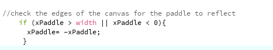
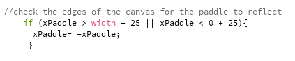

### Description of Game:

- It is a one player ping pong game. It includes a paddle and a bouncing ball. The ball should bounce off when it hits the paddle. If the ball hits the bottom of the screen, the player loses.

### 15 October 2020:

- I worked on coming up with the idea from a game to create. I watched these videos for inspiration and to get overview on the step. First video: https://youtu.be/vGLXx_OEtc4 and Tanay Singhal youtube videos on (Processing Pong Game).

### 16 October 2020: 

- I worked on creating a bouncing ball that moves randomly around the screen and reflect when it hits any of the screen's edges. To recall on how to create the ball as an object oriented I went back to Professor Dan Shiffman's videos on Youtube on (What is Object-Oriented Programming?)

### 17 October 2020:

- I worked on adding the paddle to the code, however, the paddle didn't move neither right or left, it stayed still. I used the mousePress() at first it didn't work, so I went ahead and tried it with the keyPressed, it still didn't move. 

- I tried working on differnt parts of the code and I figured that it has to be something within this part of the code but I wasn't sure what was it since when I changed it the paddle started to move in a weird way, I'm not sure how and why, but it did move down to the corner whithout the use of the keypressing function

- This is how it moved when I changed this part of the code

### 18 October 2020:

- After yesterday's work and not figuring out what was wrong, I decided to look at more videos for help. I used this video (https://youtu.be/vGLXx_OEtc4) to fix my problem which was in this part of the code. I didn't know what exaclty was the problem, maybe because the added the keyPressed() function outside the draw.

- This is how it turned after I adjusted the paddle's code.

- I worked on having the paddle to move left and right. I also added a counter and text of lives and score. I managed to restart the game with the mousepressed() function, however, I'm wasn't able to adjust the dimensions of the ball so when it touches the square it loses a live. When I reached this part with my code, I decided to change the game from a pong to another easier game since I found it hard to code the paddle's. I decided to work on a game where whenever the paddle touches the ball it loses a life, so the player has to move the paddle left and to avoid touching the ball.

- This is how my work looks now

- Although the ball still doesn't change the life when the paddle is touched, I worked on expanded dimensions of the paddle and I got what I wanted

### 19 October 2020:

- I managed to find a way to check the edges of the canvas when the box hits its edge from the left, it was by using the same method of checking it for the ball. However, the right side of the canvas didn't work. 

- I also added a sound file to the game to, its a background sound to make the player feel that he/she/they are in an arcade. I also added a background image to match the theme of the game.

- I decided to remove the score since it didn't make sense and didnt fit in the game. I kept the lives for checking the lose of the player.

- I managed to add a screen at the beginning for the game by following the steps I found on this link (https://forum.processing.org/two/discussion/11615/how-to-make-an-instruction-scene-before-start-game). However, I still didn't find a way for the instructions to come back again after losing. Maybe i'll keep it this way since it'll be the same player playing so maybe no need for the instructions again.

- The only thing left is to find away to allow the ball to detect the position box and make the player lose a life.

### 20 October 2020

- Today I worked on fixing the problem of detecting the overlapping of the moving box and ball I had in my game. My problem was trying to avoid or detect the overlapping of my moving box and ball. The first option I did was that I tried to have an if condition where it detects when the box's x and ball's x position meet and box's y and ball's y position meet. However, when I tried it, it turned out to be ridiculous since, it would only when they are exactly equal. So, I tried expanding the x position range and it still didn't work.

- This is what I was trying to do:

- This is how the game reacted:

- To overcome this issue, I asked on Discord for help and I got help from both Professor Shiloh and Professor Sherwood. I also tried googling this issue and I used this link (http://jeffreythompson.org/collision-detection/circle-rect.php) for help which was great. Although it worked it wasn't perefct but I was satisfied with the outcome.

- I worked on the instructions that come up at the start of the game. The problem was when the player loses, the instructions of the game comes under the game itself. So what I did was I printed a black backgorund before the initial game starts and this solved the problem. Another issue with the texts was when the game over text is printed, I was printed under the ball and box, so I used the same trick with the instructions where i placed a black background behind the game over text.

- I also worked on fixing the sound issue, so, the song I had playing would play forever since it was long but wouldnt stop or start again when the player loses. I fixed the problem by adding the file.stop function when the player loses and in this way the sound played from the beginning the next round.

- One thing I noticed was the initial position of the ball and box whenever the game starts, since I assigned them to start at the middle, the player would automatically lose lives since they overlapped, so I changed the intital positions to avoid this problem.

- I also adjusted the size for the box to rectangle, because it looked nicer and it looked like a paddle which was what I wanted to created before this game. Furthermore, I changed the speed of the ball for it to have a random speed.

- This is how it turned out after I fixed the problem:

### 23 October 2020

- Today the only thing I did was that I added comments to my code.

### 24 October 2020

- Today I worked on fixing the part od the code with the paddle checks the edges to not get off the canvas. In my older version, the checkedges width of the paddle only worked for the left side of the canvas.

- This was the intitial part of the code with only worked for the left side of the canvas.

- Then I added the same restrictions I had for the ball to bounce and this is how it turned.

- Finally i realized that I needed to subtract the whole width of the paddle from the width of the canvas for the paddle not to move over the screen, and this is how it turned out. 

