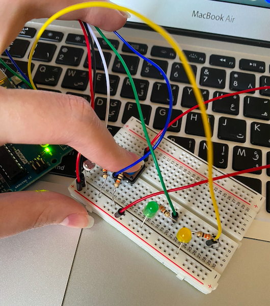
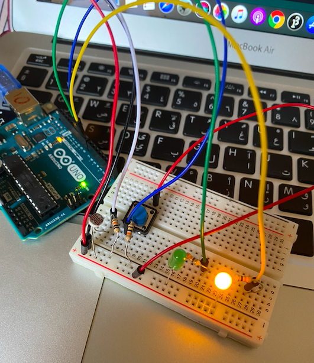
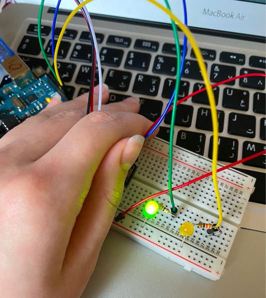
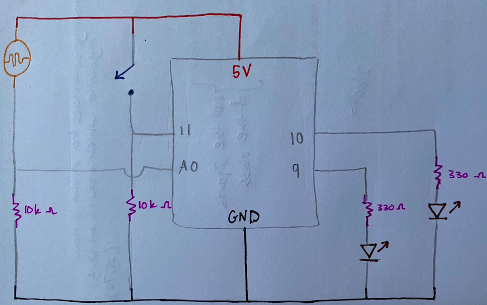

# Assignment 7: Analog Sensor and Digital Sensor

## Assignment Journey

### Description of concept

The LEDs should work depending on what information they get from the LDR. Depending on the information they get, one LED would work while the other LED would be off. The way the LEDs work is by fading. On the other hand, if the button was pressed both LEDs would turn off and won't work depending on the LDR. It is a way of restarting the program.

### Challenges

At first the program worked well. However, the problem was having the one LED fading for certain information from the LDR while the other off. When one LED would be fading the other LED would be on but not fading. So, to solve this issue I added a statement where it turns the LED with no information off wil the other with information on (fading).

## My Analog Sensor and Digital Sensor

### Pictures:

### Note: The video of how the sensors work is very big to be displayed, but it can be downloaded to be viewed. The video is in November 10 folder named "movie.mov"

## Schematic

