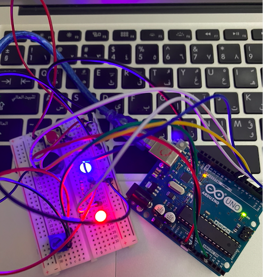
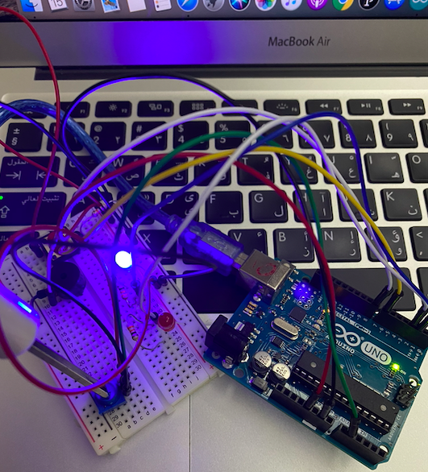
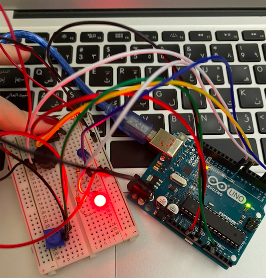
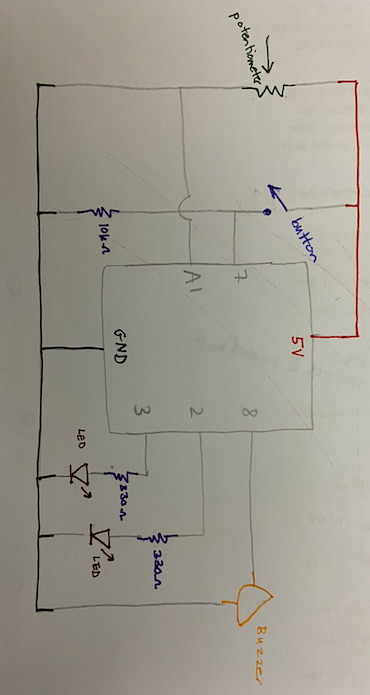

# Assignment 8: Musical Instrument

## Assignment Journey

### Description of concept

For the musical instrument I used the button as a digital sensor and the potentiometer as an analog sensor. When the potentiometer's value is greater than 100, the buzzer works at low frequency which is 1047 and the led turns off, else the buzzer turns off and the led turns on. On the other hand, when the button is pressed, the buzzer works at high frequency which is 4070 and the other led turns off, else the buzzer turns off and the led turns on. 

### Challenge

I had problem with the sensor where it wasn't working. I noticed there was a problem with the sensor because the buzzer wasn't working and the led was on all the time which proved that the sensor was not working. So, I used the serial.print() function option to print the value of the sensor. I got only 0 values which proved that there was an issue with the wiring of the sensor. The problem was that I miss placed the middle point with the 5V point.

## My Musical Instrument

### Pictures:

### Note: The video of how the musical instrument work is very big to be displayed, but it can be downloaded to be viewed. The video is in November 17 folder named "movie.mov"

## Schematic

