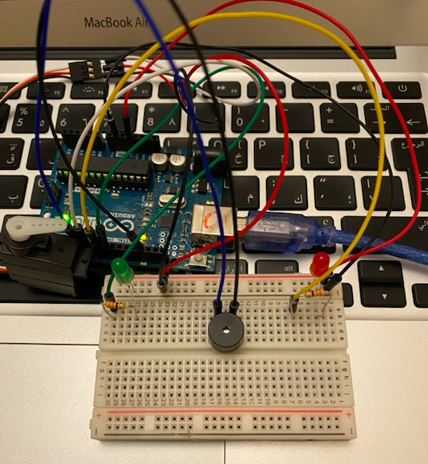
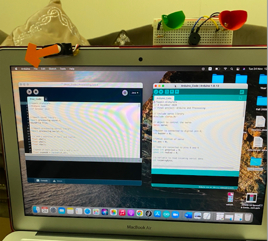
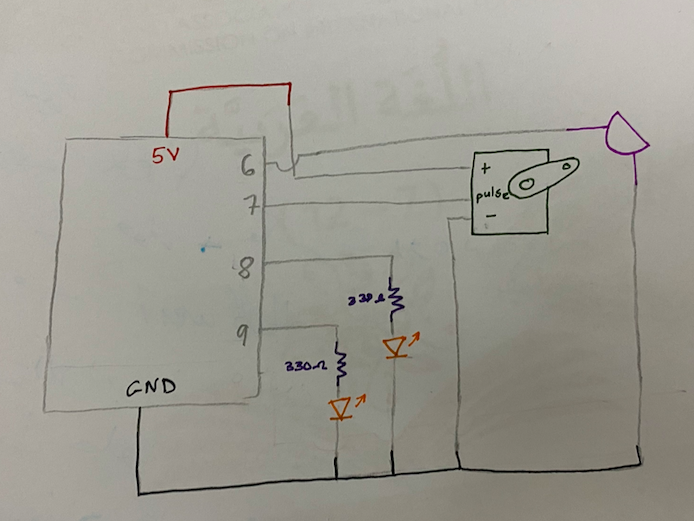

# Assignment 9: Arduino and Processing Game

## Assignment Journey

### Description of game

It's a modification of my midterm game.

- Processing part: It is a one player game, where the l and r keys are used to move the paddle aways from the boucing ball trying to avoid touching it. If the paddle touches the ball, then the player loses some lives. 
- Arduino part: When the game starts a green LED lights up and when the player loses, and the game is over a red LED blink with a buzzer that beeps. In addition, a servo motor moves left and right depending on which key is pressed. 

### Challenges:

- I wanted the red LED to open when the player loses and close when the game starts again. However, this didn’t work, the LED didn’t close after losing the game and stayed open. To solve this problem. I had the part of the Arduino code which was for the red LED to blink and in this way, it closed after blinking indicating that the player lost.

- I had the buzzer in a special loop of its own so when the incomingByte is B, the sound works. However, it didn’t work, and I thought there was something wrong with the code so what I did was the buzzer and red LED in the same loop since they work when the game is over. But it still didn’t work, and I went ahead and tried to alter the processing code, yet nothing happened. I finally solved the problem when I realized that the buzzer was connected to a different pin than the one, I had it attach to in the code. 

## My Game

### Pictures:

### Note: The video of how the game works is very big to be displayed, but it can be downloaded to be viewed. The video is in this link (https://drive.google.com/file/d/18W0CupSZyVannEHDC7fnV2tM-1olfR9p/view?usp=sharing)

## Schematic

## Code support

- Arduino Example > Communication > PhysicalPixel 
- Arduino Example > Servo > Sweep
