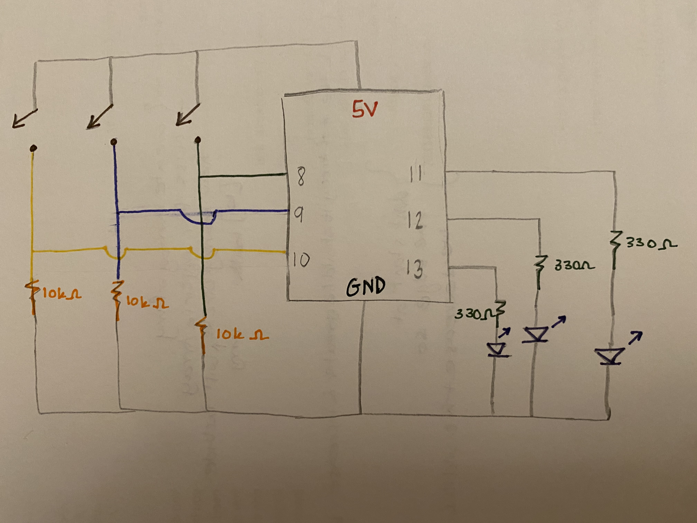

# Assignment 6: LEDs and Buttons

## Assignment Journey

### Interesting Discoveries:

- At first I thought only inputs gets to have global variables. However, I tried with one LED and it worked so I adjused my code and set all the LEDs as global variable.

### Challenges:

- I had a hard time wiring things at first where I would often misplace the resistors place or the wires that connect to the buttons and LEDs. After wiring things several times and watching the class recording again, I figured it out and it worked.

## My LEDs and Buttons:

The video of how the buttons and LEDs work is very big to be displayed, but it can be downloaded to be viewed. The video is in November 3 folder named "movie.MP4"

## Schematic:

