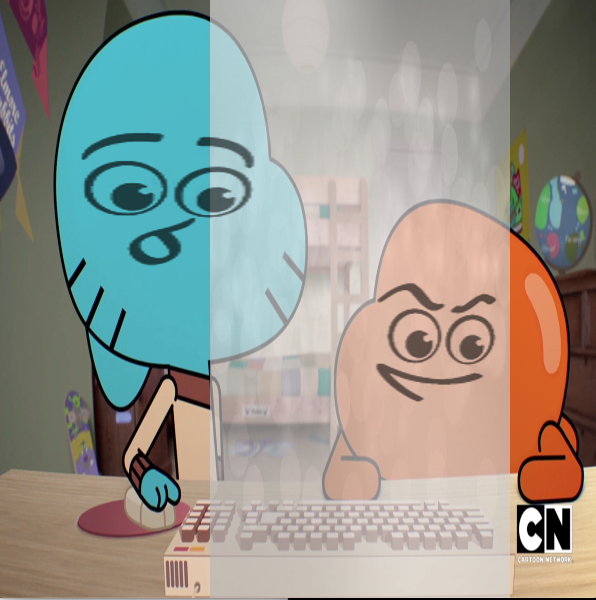

# Assignment 5: Image Processing

## Assignment Journey

### Interesting Discoveries:
- I had to have two different arrays of images to control each array separately although both arrays carried the same images.

### Challenges:
- I had a hard time figuring out how to use transparent image, but I solved the issue by using changing the images and using png. However, i'm not sure what the exact problem was but it worked.
- I wanted to have the faces of the characters I choose to be in the background, however, it was hard collecting different face expression for each character, so I decided to find normal face expressions and add them to the heads.

## My Image Processing:

## Description:
I used a static background of an image of 2 heads without faces. Then I added an array of different images of face expressions for each head. Once the face of the characters is clicked they change randomly. I also added the song of the cartoon that plays once when the code is run. I added a moving transparent image to add abit of effect to the image.

## Inspiration and References:

Image Inspiration: 

- 

Code reference: 

- Professor Dan Shiffman's code from (Contributed Examples, Learning Processing 2nd Edition, Chp15 Images Pixels, Example 3)
- https://processing.org/examples/transparency.html

Sound code reference:

-https://processing.org/reference/libraries/sound/SoundFile.html

