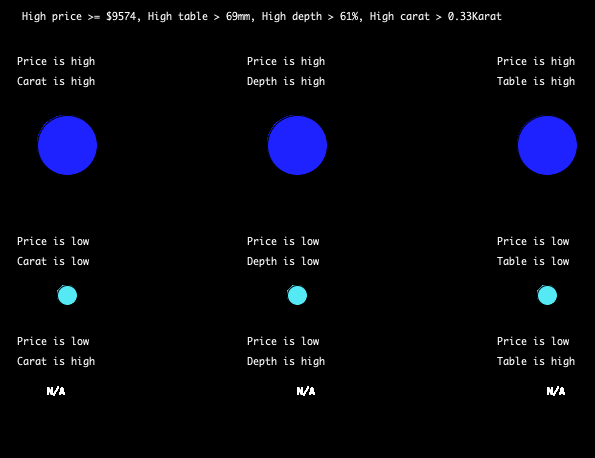
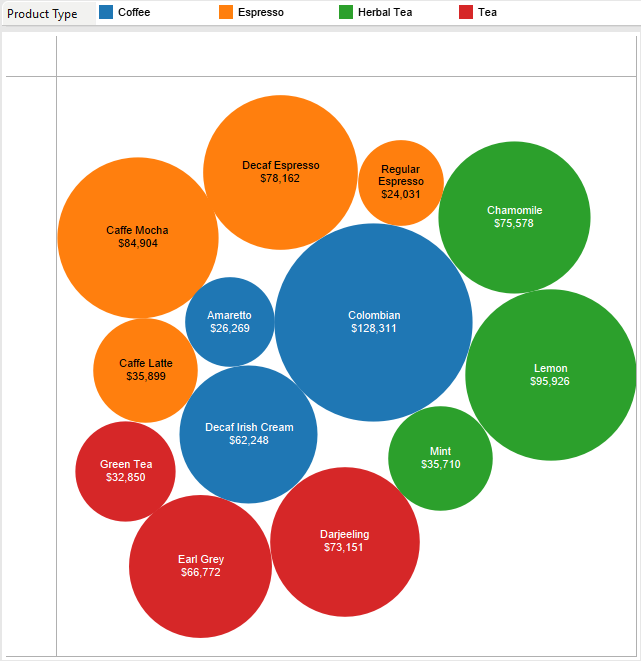
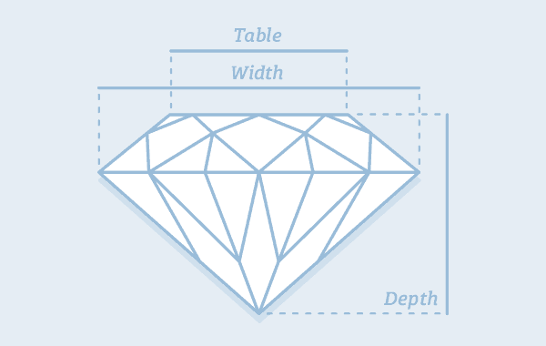

# Assignment 4: Data Visualization

## Assignment Journey

### Intresting Discoveries:
- Rather than using the the loadString function, I used the loadTable function to extract the data from the CSV file.

### Challanges:
- I wanted my text to be under each other by using one text function but it didnt work. So I used the two text functions and adjusted the height to have them under each other.
- I wanted the if statements to work for certain variable, however, the variables were local variables in the for loop so it was hard using them. What I did was that I included my if statements in the for loop to use the same variables.
- The data I used was in a form of table and had a header. I used the loadtable function to extract the data and the header of the table separately.

## My Data Visualization:

## Description:

The data visulization I made was about the price of diamonds compared with depth: total depth percentage, carat weight of the diamond and the table width of top of diamond relative to widest point of the diamonds. The bigger the price the bigger the depth, carats, and table. However, the smaller the price, the smaller the smaller the depth, carats and table. The relationship was described with big and small circles and texts that describe what data is being represented. Alongside this, I used an if statement to check if as the price decrease the depth, table, and carat increase, if it work it would place a circle otherwise an N/A is displayed.

## Inspiration and References:

Image Inspiration: 

- 
- 

For using the table function: 

- https://youtu.be/dbs4IYGfAXc

The CSV file was taken from:

- https://www.kaggle.com/shivam2503/diamonds

