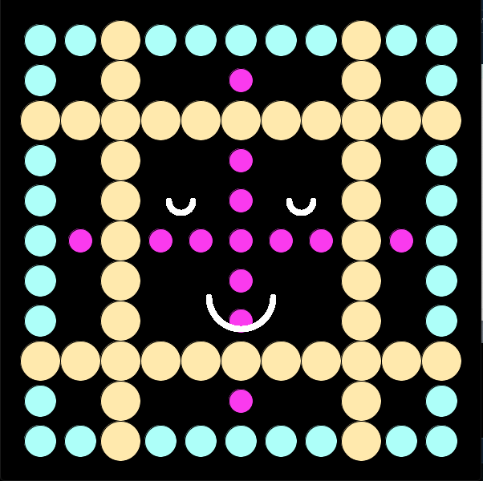

# Assignment 2: A Simple Work of Art

## Assignment 2 Journey

### Intresting Discoveries:
- I used the circles to create an art work.
- I like how it ended up like the face of a character from a video game.

### Challanges:
- It took me a while to know how exactly I should use the while loop in my code.

## My Art Work:

