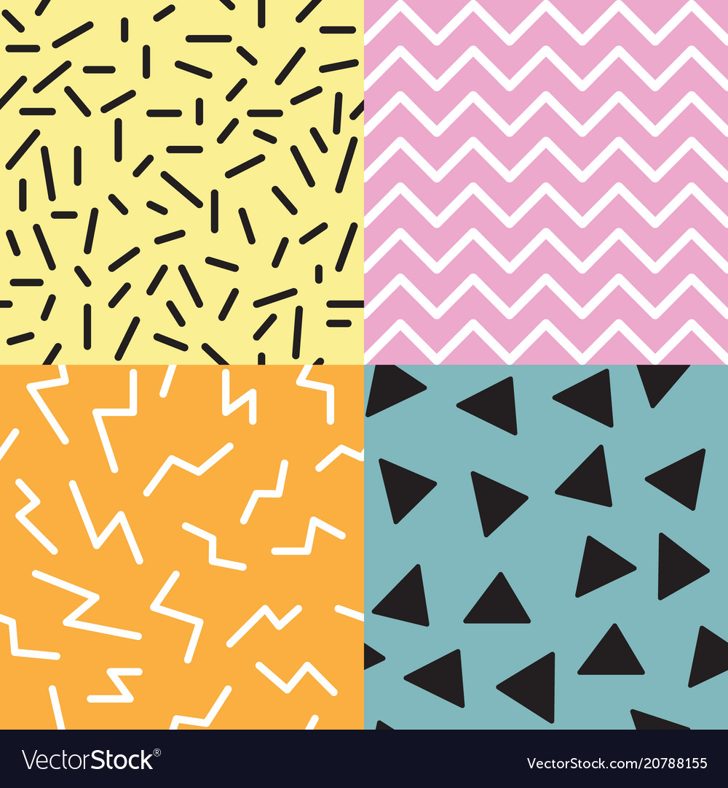

# Assignment 3: Artwork

## Assignment Journey

### Intresting Discoveries:
- I had to add the push and pop functions for each object-oriented program for the translate function not to effect the other translate functions in other object-oriented programs.

### Challanges:
- It was hard to divide the artwork into four parts. I used the translate function to overcome this challenge.
- Two have two different circle or square shape in each part without them having the same position was hard. I used assigned different variables to overcome this challange.

## My Artwork:

## Description:

The artwork includes 4 different parts and each part has 2 different shades of the same color. Each part of the artwork was coded depending on the color -  four different classes were made. The arrays and random functions were used to include 50 squares and circles placed randomly in each part.

## Inspiration and References:

Image Inspiration: 

- 
- https://youtu.be/KkyIDI6rQJI

For translation and rotation of code: 

- https://youtu.be/o9sgjuh-CBM

For Object-Oriented code:

- https://youtu.be/YcbcfkLzgvs
